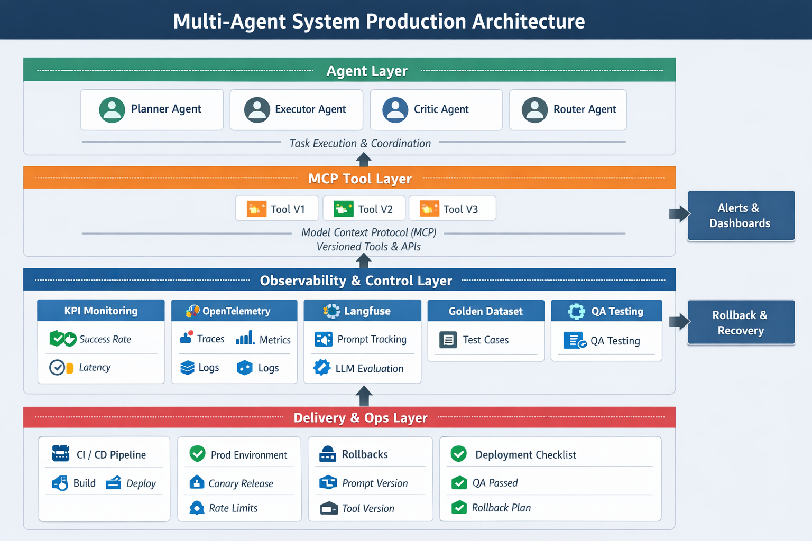

This is a **real-world multi-agent production question** . A **production readiness + MLOps/LLMOps playbook** for **multi-agent systems using MCP tools**.

Below is a **clear, practical, end-to-end plan**, mapped exactly to your numbered points, with **options and tradeoffs**.

---

<!--  -->

<!--  -->

<!--  -->

<!--  -->

# High-Level Architecture (Mental Model)

Think in **4 layers**:

1. **Agent Layer** – planners, executors, critics, routers
2. **Tool Layer (MCP)** – versioned tools, permissions, timeouts
3. **Observability & Control Layer** – metrics, traces, evals
4. **Delivery Layer** – CI/CD, environments, rollback, governance

Everything you asked fits into one of these.



---

# 7. KPI Monitoring (Core Signals)

### What to measure (minimum viable KPIs)

**Agent Effectiveness**

* Task success rate (binary or scored)
* Plan completion %
* Retry count per agent
* Tool success vs failure ratio

**Quality**

* Human eval score
* Automated eval score (LLM-as-judge)
* Hallucination rate
* Policy violations

**Performance**

* Latency per agent
* Tool execution latency
* Tokens per request
* Cost per task

**Reliability**

* Error rate
* Timeout rate
* Agent crash loops

### Implementation

* Emit **custom metrics per agent + per tool**
* Tag metrics with:

  * agent_name
  * prompt_version
  * tool_version
  * environment

> KPI dashboards should answer:
> *“Which agent broke, why, and since which version?”*

---

# 8. OpenTelemetry (Distributed Tracing Backbone)

### Why it matters

Multi-agent = **distributed system**, not a chatbot.

### What to trace

* Root trace = user request
* Child spans:

  * planner agent
  * executor agent
  * tool calls (MCP)
  * retries
  * fallbacks

### What to include in spans

* prompt hash
* model name
* tool name
* latency
* error metadata

### Setup

* OpenTelemetry SDK in agent runtime
* Exporters:

  * Metrics → Prometheus
  * Traces → Jaeger / Tempo
  * Logs → Loki / ELK

This gives you **end-to-end causality**.

---

# 9. Langfuse (LLM-Native Observability)

### What Langfuse is best for

* Prompt versioning
* Trace visualization
* Cost tracking
* Dataset creation
* Online evals

### Recommended usage

* Every agent call → Langfuse trace
* Log:

  * prompt version
  * input/output
  * model
  * tool metadata
* Attach eval scores later

> Langfuse ≠ OpenTelemetry
> They **complement** each other:

* OpenTelemetry → infra & latency
* Langfuse → LLM behavior & quality

---

# 10. Golden Dataset Preparation

### What is “golden” here?

**Real, representative, frozen test cases** that must *never regress*.

### Sources

* High-confidence production runs
* Human-reviewed outputs
* Edge cases + failures
* Customer-approved examples

### Structure

Each example:

```json
{
  "input": "...",
  "expected_behavior": "...",
  "tools_allowed": [...],
  "success_criteria": {...},
  "agent_path_expected": [...]
}
```

### Usage

* Regression testing
* Prompt changes
* Tool version upgrades
* Model swaps

---

# 11 & 14. Testing – QA Setup (You listed twice, so here’s a clean split)

## A. Offline Testing (Pre-Merge)

* Golden dataset replay
* Deterministic seeds
* Mock MCP tools
* LLM-as-judge scoring

## B. Online QA (Post-Deploy)

* Shadow traffic
* Canary agents
* A/B prompt testing
* Human review sampling

---

# 12. CI/CD for Multi-Agent Systems

### CI Pipeline

1. Lint prompts (structure + policy)
2. Unit test tools
3. Replay golden dataset
4. Compare metrics vs baseline
5. Block merge if regression

### CD Pipeline

* Build agent bundle (prompts + tools)
* Tag versions
* Deploy to staging
* Canary release to prod

> **Key idea:**
> Prompts and tools are **first-class deployable artifacts**, not text blobs.

---

# 13. Production Environment Design

### Environments

* Dev – fast iteration
* QA/Staging – frozen datasets
* Prod – locked down, audited

### Production safeguards

* Tool permissioning (MCP)
* Rate limits per agent
* Hard timeouts
* Cost ceilings
* Kill switch per agent

---

# 15. Deployment Checklist (Client-Friendly)

**Before deploy**

* ✅ Golden dataset passing
* ✅ KPI baseline recorded
* ✅ Rollback plan defined
* ✅ Canary percentage set
* ✅ Alerts configured

**After deploy**

* 🔍 Monitor KPIs (first 24h)
* 🔍 Compare vs baseline
* 🔍 Human review sample
* 🔍 Cost anomaly check

---

# 16. When KPIs Don’t Meet Expectations

### Diagnosis playbook

1. Which KPI failed?
2. Which agent/tool?
3. Since which version?
4. Regression or data drift?

### Typical fixes

* Prompt tightening
* Tool constraint changes
* Agent routing logic update
* Model downgrade or upgrade

> Avoid “prompt thrashing” — always compare against baseline traces.

---

# 17. Rollbacks (Agentic Rollback Strategy)

### Rollback dimensions (independent!)

1. Prompt version
2. Tool version (MCP)
3. Model version
4. Agent graph topology

### Best practice

* Immutable versions
* Version pinning per agent
* One-click rollback
* Automatic rollback if KPI threshold breached

Example:

```yaml
agent:
  planner:
    prompt_version: v12
    model: gpt-4.1
    tools:
      search: v3
```

---

# How I’d Explain This to the Client (One-liner)

> “We treat multi-agent AI like a distributed production system:
> versioned prompts, observable agents, tested behaviors, and safe rollbacks — not experimental prompt hacking.”

---

If you want, next I can:

* Turn this into a **client-ready architecture diagram**
* Create a **deployment checklist doc**
* Design **KPI dashboards**
* Propose **tool versioning standards for MCP**
* Help you defend **why this is necessary (ROI argument)**

Just tell me what you need next.
