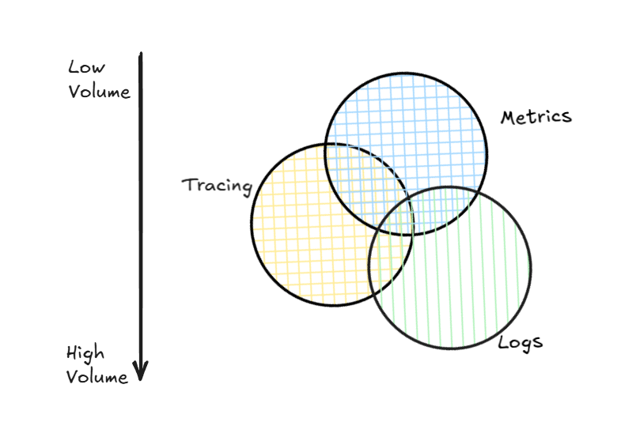

---

## What is Observability (for AI Agents)?

**Observability** is the ability to **understand what your agent is doing internally by looking at its outputs and signals**, without modifying its code each time.

For **AI agents**, this means answering questions like:

* ❓ *Why did the agent choose this tool?*
* ❓ *Why did it hallucinate?*
* ❓ *Why did this request take 18 seconds?*
* ❓ *Why did it fail only for one user?*
* ❓ *Which step caused the error or bad answer?*

Observability is built on **three pillars**:

1. **Tracing** – What happened, step by step
2. **Logs** – What was said/thought at each step
3. **Metrics** – How often, how slow, how costly


<!-- 


 -->
## 8️⃣ Logs vs Traces vs Metrics (Agent Context)




| Signal  | Agent Usage         |
| ------- | ------------------- |
| Traces  | What happened       |
| Logs    | Why it happened     |
| Metrics | How often & how bad |

**Golden rule**:

> Logs explain spans
> Spans explain metrics
---

## What is Tracing (Specifically for Agents)?

**Tracing** records the **entire lifecycle of a single agent request**.

For an AI agent, a single trace might include:

```
User Query
 → Prompt Construction
 → LLM Call
 → Tool Selection
 → Tool Execution
 → Tool Output
 → Second LLM Call
 → Final Answer
```

Each step is called a **span**, and all spans together form a **trace**.

<!-- 


 -->

---

## Why Observability is CRITICAL for AI Agents (Not Optional)

### 1. Agents are **Non-Deterministic**

Unlike traditional code:

* Same input ≠ same output
* Decisions depend on probabilities, context, and prompts

➡️ **You cannot debug agents by reading code alone**

---

### 2. Agent Failures are Often “Silent”

Examples:

* Wrong tool chosen
* Correct tool, wrong parameters
* Hallucinated reasoning
* Partial execution

Without observability:

> ❌ You only see a bad final answer
> With observability:
> ✅ You see *exactly which step went wrong*

---

### 3. Cost & Latency Can Explode Quietly

Agent issues often show up as:

* Too many LLM calls
* Recursive loops
* Large prompts
* Slow tools

Observability lets you track:

* Tokens per step
* Cost per trace
* Time per span

---

### 4. Required for Enterprise & Audits

For production AI systems, you need:

* Traceability
* Explainability
* Accountability
* Compliance

Especially relevant for:

* Financial systems
* Healthcare
* Internal enterprise tools (like the ones you build)

---


## Key Features of Observability & Tracing for Agents

### 1. End-to-End Agent Tracing ⭐⭐⭐⭐⭐

You should see:

* Every LLM call
* Every tool call
* Every retry
* Every failure

Each trace should answer:

> *“What exactly did the agent do?”*

---

### 2. Hierarchical Spans (Agent → Tool → Sub-Tool)

Example:

```
Trace: UserQuery
 ├── Span: Agent Planning
 ├── Span: LLM Call (gpt-4o)
 ├── Span: Tool Call (Search)
 │    └── Span: HTTP Request
 └── Span: Final LLM Response
```

This hierarchy is essential to:

* Find bottlenecks
* Pinpoint failures
* Optimize workflows

---

### 3. Prompt & Response Visibility (Safely)

You should be able to inspect:

* System prompt
* User prompt
* Tool descriptions
* Model responses

With:

* Masking of secrets
* PII redaction
* Sampling controls

---

### 4. Tool Invocation Tracking

For each tool call:

* Tool name
* Parameters
* Execution time
* Output
* Errors

This is **agent-specific observability** (classic tracing doesn’t cover this).

---

### 5. Token, Cost & Model Metrics

Must-have metrics:

* Input tokens
* Output tokens
* Cost per request
* Cost per user
* Cost per agent step

This is critical for:

* Budget control
* Scaling decisions
* Model comparisons

---

### 6. Error & Hallucination Detection Signals

Observability helps detect:

* Empty tool outputs
* Invalid JSON
* Repeated retries
* Contradictory reasoning
* Unexpected model behavior

These signals are invisible without tracing.

---

### 7. Correlation Across Systems

A single agent trace should link to:

* API Gateway logs
* Backend service logs
* Vector DB queries
* Search index calls

This is usually done via **trace IDs** (commonly via OpenTelemetry).

---

## What Observability Looks Like Without vs With Tracing

| Without Tracing   | With Tracing          |
| ----------------- | --------------------- |
| “Agent failed”    | Tool X timed out      |
| “Answer is wrong” | Prompt missed context |
| “Too slow”        | LLM call #2 took 9s   |
| “Too expensive”   | Infinite tool loop    |
| Guessing          | Evidence-based fixes  |

---

## When Should You Add Observability?

**Immediately if:**

* You use tool-calling agents
* You have multi-step reasoning
* You deploy to production
* You care about cost & reliability

**Absolutely mandatory if:**

* Enterprise / regulated environment
* Multi-agent systems
* Customer-facing AI

---

## Simple Mental Model

> **Observability for agents = debugger + profiler + audit log + cost tracker**

Without it, you are **flying blind**.

---

---


I’ll move **from concepts → architecture → span design → implementation flow → best practices**.

---

## 1️⃣ What “OpenTelemetry-style Agent Tracing” Means

**OpenTelemetry (OTel)** is a **vendor-neutral standard** for generating, collecting, and exporting:

* **Traces** → request flows
* **Spans** → individual operations
* **Metrics** → performance & cost signals
* **Logs** → contextual events

In agent systems, we **extend OTel concepts** to cover **LLM-specific behavior**.

> 🔑 Key idea:
> **One user query = one trace**
> **Each agent action = one span**


---

## 2️⃣ Core OpenTelemetry Concepts (Agent Mapping)

| OpenTelemetry Concept | Agent Meaning                  |
| --------------------- | ------------------------------ |
| Trace                 | One agent execution            |
| Span                  | One agent step                 |
| Parent Span           | Agent controller               |
| Child Span            | LLM call / tool call           |
| Attributes            | Prompt, tokens, model          |
| Events                | Errors, retries, warnings      |
| Trace ID              | Correlation key across systems |

---

## 3️⃣ High-Level Architecture (Agent Tracing)


### Typical Flow

```
User Request
  ↓
Agent Runtime
  ↓ (create trace)
LLM Calls / Tool Calls
  ↓ (create spans)
OpenTelemetry SDK
  ↓
OTel Collector
  ↓
Tracing Backend (Jaeger / Tempo / Azure Monitor)
```

---

## 4️⃣ Designing a Trace for an AI Agent

### Trace Structure (Recommended)

```
Trace: agent.request
 ├── agent.plan
 ├── llm.call (model=gpt-4o)
 ├── tool.call (search)
 │    └── http.request
 ├── llm.call (final answer)
 └── agent.response
```

This hierarchy is **critical**:

* Debug reasoning
* Detect loops
* Attribute cost
* Identify latency hotspots

---

## 5️⃣ Span Taxonomy for Agents (VERY IMPORTANT)

### 1. Agent Controller Span (Root)

**Span name**

```
agent.request
```

**Attributes**

```json
{
  "agent.name": "support-agent",
  "agent.version": "1.3.2",
  "user.id": "masked",
  "session.id": "abc123"
}
```

This span:

* Owns the trace
* Links everything together
* Is created at request entry

---

### 2. Planning / Reasoning Span

```
agent.plan
```

Captures:

* Prompt construction
* Tool availability
* System instructions

**Attributes**

```json
{
  "prompt.tokens": 1342,
  "tools.available": ["search", "db_lookup"]
}
```

---

### 3. LLM Call Span ⭐⭐⭐⭐⭐

```
llm.call
```

This is the **most important span**.

**Attributes**

```json
{
  "llm.provider": "openai",
  "llm.model": "gpt-4o",
  "llm.temperature": 0.2,
  "tokens.input": 812,
  "tokens.output": 243,
  "cost.usd": 0.0124
}
```

**Optional (but powerful):**

* Prompt hash (not full prompt)
* Completion hash
* Sampling flags

---

### 4. Tool Call Span

```
tool.call
```

**Attributes**

```json
{
  "tool.name": "search",
  "tool.type": "external_api",
  "tool.args": "masked",
  "tool.duration_ms": 420
}
```

If tool internally calls services → **nested spans**.

---

### 5. Error & Retry Events

Instead of new spans, add **events**:

```
Span: llm.call
 └── Event: retry_attempt
 └── Event: invalid_json
```

Events are better than spans for:

* Hallucinations
* Validation failures
* Parsing errors

---

## 6️⃣ How This Is Implemented in Code (Conceptual Flow)

> This is language-agnostic logic.

### Step 1: Create a Tracer

* Initialize OTel SDK
* Configure exporter (Jaeger, Azure Monitor, etc.)
* Set service name = agent service

---

### Step 2: Start Root Trace

At request entry:

```
with tracer.start_span("agent.request"):
    run_agent()
```

This generates:

* Trace ID
* Root span

---

### Step 3: Instrument the Agent Runtime

Wrap **every agent action**:

| Action       | Span                |
| ------------ | ------------------- |
| Prompt build | agent.plan          |
| LLM call     | llm.call            |
| Tool call    | tool.call           |
| Retry        | event               |
| Failure      | span status = ERROR |

---

### Step 4: Propagate Context

Context propagation ensures:

* Tool calls inherit trace ID
* HTTP requests attach trace headers
* Vector DB queries link to same trace

This is native to OpenTelemetry.

---

## 7️⃣ Metrics Generated from Traces

OTel **derives metrics automatically**:

| Metric         | Source               |
| -------------- | -------------------- |
| Avg latency    | span duration        |
| Token usage    | llm.call attributes  |
| Error rate     | span status          |
| Cost per agent | cost.usd aggregation |

These metrics power:

* Dashboards
* Alerts
* Budget limits

---

## 8️⃣ Logs vs Traces vs Metrics (Agent Context)


| Signal  | Agent Usage         |
| ------- | ------------------- |
| Traces  | What happened       |
| Logs    | Why it happened     |
| Metrics | How often & how bad |

**Golden rule**:

> Logs explain spans
> Spans explain metrics

---

## 9️⃣ Privacy, Security & Compliance (Critical)

### Never store raw prompts blindly

Best practice:

* Hash prompts
* Mask PII
* Sample traces
* Encrypt exports

Example:

```
prompt.sha256 = "a94a8fe5..."
```

This supports:

* Audits
* Debugging
* Responsible AI

---

## 🔟 Common Mistakes (Avoid These)

❌ Single span per request
❌ No tool-level tracing
❌ No token/cost attributes
❌ Logging prompts without masking
❌ No correlation with backend services

---

## 1️⃣1️⃣ Why OpenTelemetry is the Right Model

| Reason           | Explanation              |
| ---------------- | ------------------------ |
| Vendor-neutral   | Works everywhere         |
| Standardized     | Same mental model        |
| Scalable         | Handles high volume      |
| Extensible       | Perfect for LLM metadata |
| Enterprise-ready | Audits & compliance      |

This is why **LangSmith, Phoenix, Azure AI Tracing** all **follow OTel concepts internally**, even if they abstract it.

---

## 1️⃣2️⃣ Mental Model (Remember This)

> **Agent tracing = distributed tracing + LLM semantics**

You’re not just tracing services.
You’re tracing **decisions**.

---

---
