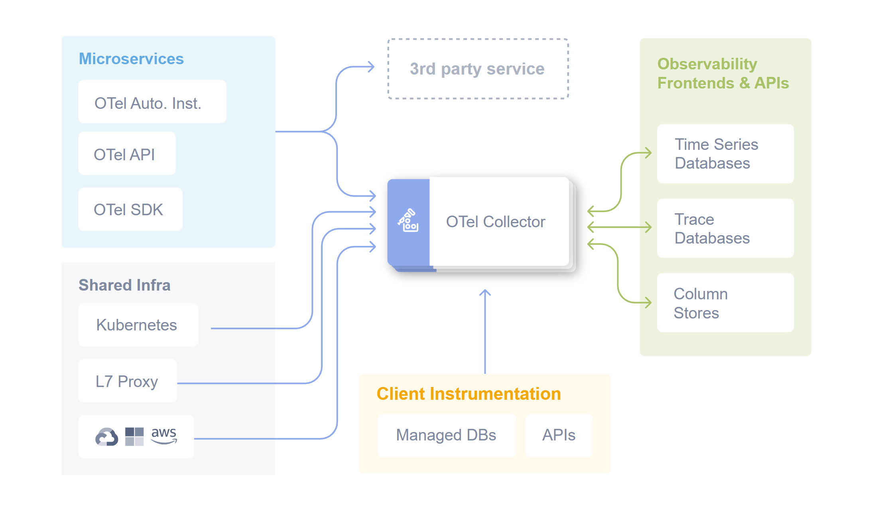
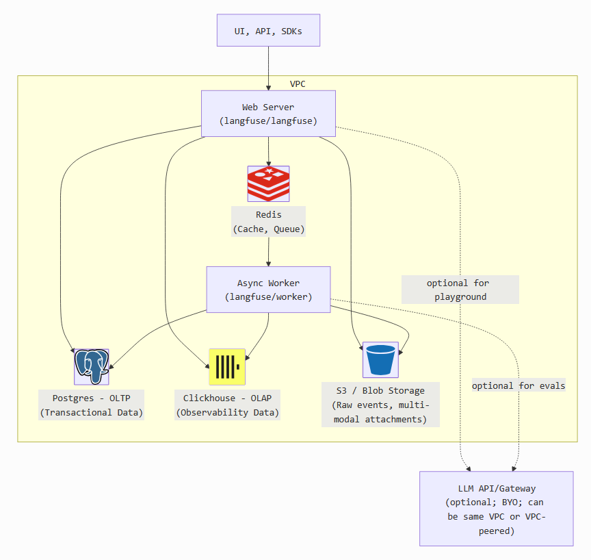
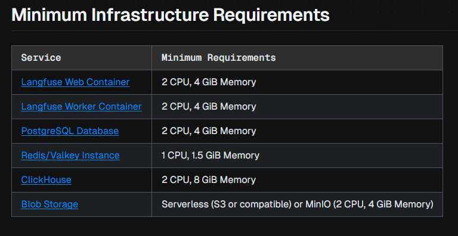
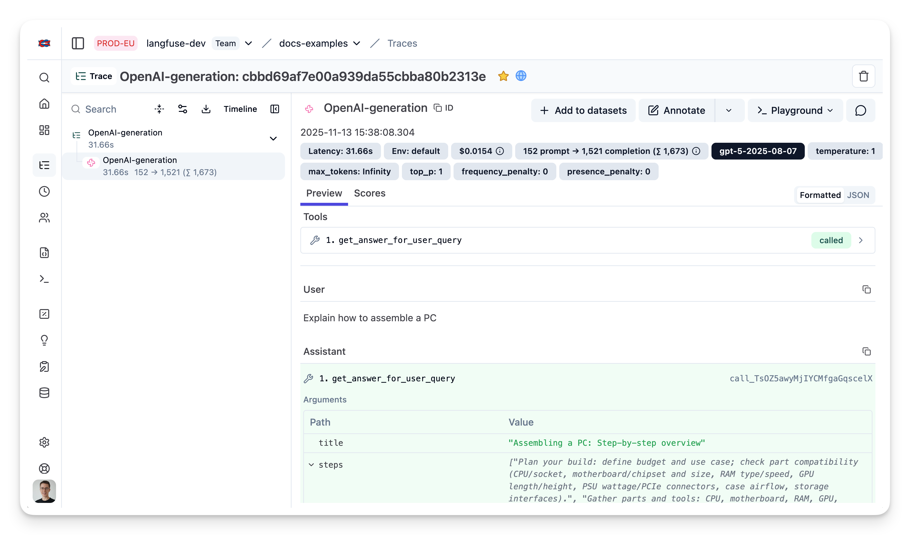

---
# A. LLM Observability

## What is Observability (for AI Agents)?

**Observability** is the ability to **understand what your agent is doing internally by looking at its outputs and signals**, without modifying its code each time.

For **AI agents**, this means answering questions like:

* ❓ *Why did the agent choose this tool?*
* ❓ *Why did it hallucinate?*
* ❓ *Why did this request take 18 seconds?*
* ❓ *Why did it fail only for one user?*
* ❓ *Which step caused the error or bad answer?*

Observability is built on **three pillars**:

1. **Tracing** – What happened, step by step
2. **Logs** – What was said/thought at each step
3. **Metrics** – How often, how slow, how costly


<!-- 


 -->
## Logs vs Traces vs Metrics (Agent Context)


| Signal  | Agent Usage         |
| ------- | ------------------- |
| Traces  | What happened       |
| Logs    | Why it happened     |
| Metrics | How often & how bad |

**Golden rule**:

> Logs explain spans
> Spans explain metrics
---

## What is Tracing (Specifically for Agents)?

**Tracing** records the **entire lifecycle of a single agent request**.

For an AI agent, a single trace might include:

```
User Query
 → Prompt Construction
 → LLM Call
 → Tool Selection
 → Tool Execution
 → Tool Output
 → Second LLM Call
 → Final Answer
```

Each step is called a **span**, and all spans together form a **trace**.

<!-- 


 -->

---

## Why Observability is CRITICAL for AI Agents (Not Optional)

### 1. Agents are **Non-Deterministic**

Unlike traditional code:

* Same input ≠ same output
* Decisions depend on probabilities, context, and prompts

➡️ **You cannot debug agents by reading code alone**

---

### 2. Agent Failures are Often “Silent”

Examples:

* Wrong tool chosen
* Correct tool, wrong parameters
* Hallucinated reasoning
* Partial execution

Without observability:

> ❌ You only see a bad final answer
> With observability:
> ✅ You see *exactly which step went wrong*

---

### 3. Cost & Latency Can Explode Quietly

Agent issues often show up as:

* Too many LLM calls
* Recursive loops
* Large prompts
* Slow tools

Observability lets you track:

* Tokens per step
* Cost per trace
* Time per span

---

### 4. Required for Enterprise & Audits

For production AI systems, you need:

* Traceability
* Explainability
* Accountability
* Compliance

Especially relevant for:

* Financial systems
* Healthcare
* Internal enterprise tools (like the ones you build)

---

## Key Features of Observability & Tracing for Agents

### 1. End-to-End Agent Tracing ⭐⭐⭐⭐⭐

You should see:

* Every LLM call
* Every tool call
* Every retry
* Every failure

Each trace should answer:

> *“What exactly did the agent do?”*

---

### 2. Hierarchical Spans (Agent → Tool → Sub-Tool)

Example:

```
Trace: UserQuery
 ├── Span: Agent Planning
 ├── Span: LLM Call (gpt-4o)
 ├── Span: Tool Call (Search)
 │    └── Span: HTTP Request
 └── Span: Final LLM Response
```

This hierarchy is essential to:

* Find bottlenecks
* Pinpoint failures
* Optimize workflows

---

### 3. Prompt & Response Visibility (Safely)

You should be able to inspect:

* System prompt
* User prompt
* Tool descriptions
* Model responses

With:

* Masking of secrets
* PII redaction
* Sampling controls

---

### 4. Tool Invocation Tracking

For each tool call:

* Tool name
* Parameters
* Execution time
* Output
* Errors

This is **agent-specific observability** (classic tracing doesn’t cover this).

---

### 5. Token, Cost & Model Metrics

Must-have metrics:

* Input tokens
* Output tokens
* Cost per request
* Cost per user
* Cost per agent step

This is critical for:

* Budget control
* Scaling decisions
* Model comparisons

---

### 6. Error & Hallucination Detection Signals

Observability helps detect:

* Empty tool outputs
* Invalid JSON
* Repeated retries
* Contradictory reasoning
* Unexpected model behavior

These signals are invisible without tracing.

---

### 7. Correlation Across Systems

A single agent trace should link to:

* API Gateway logs
* Backend service logs
* Vector DB queries
* Search index calls

This is usually done via **trace IDs** (commonly via OpenTelemetry).

---

## What Observability Looks Like Without vs With Tracing

| Without Tracing   | With Tracing          |
| ----------------- | --------------------- |
| “Agent failed”    | Tool X timed out      |
| “Answer is wrong” | Prompt missed context |
| “Too slow”        | LLM call #2 took 9s   |
| “Too expensive”   | Infinite tool loop    |
| Guessing          | Evidence-based fixes  |

---

## When Should You Add Observability?

**Immediately if:**

* You use tool-calling agents
* You have multi-step reasoning
* You deploy to production
* You care about cost & reliability

**Absolutely mandatory if:**

* Enterprise / regulated environment
* Multi-agent systems
* Customer-facing AI

---

## Simple Mental Model

> **Observability for agents = debugger + profiler + audit log + cost tracker**

Without it, you are **flying blind**.

---

---
# B. OTel

## 1️⃣ What “OpenTelemetry-style Agent Tracing” Means

**OpenTelemetry (OTel)** is a **vendor-neutral standard** for generating, collecting, and exporting:

* **Traces** → request flows
* **Spans** → individual operations
* **Metrics** → performance & cost signals
* **Logs** → contextual events

In agent systems, we **extend OTel concepts** to cover **LLM-specific behavior**.

> 🔑 Key idea:
> **One user query = one trace**
> **Each agent action = one span**

Why OpenTelemetry is the Right Model

| Reason           | Explanation              |
| ---------------- | ------------------------ |
| Vendor-neutral   | Works everywhere         |
| Standardized     | Same mental model        |
| Scalable         | Handles high volume      |
| Extensible       | Perfect for LLM metadata |
| Enterprise-ready | Audits & compliance      |

This is why **LangSmith, Phoenix, Azure AI Tracing** all **follow OTel concepts internally**, even if they abstract it.


<!--  -->

<!--  -->

---

## 2️⃣ Core OpenTelemetry Concepts (Agent Mapping)

| OpenTelemetry Concept | Agent Meaning                  |
| --------------------- | ------------------------------ |
| Trace                 | One agent execution            |
| Span                  | One agent step                 |
| Parent Span           | Agent controller               |
| Child Span            | LLM call / tool call           |
| Attributes            | Prompt, tokens, model          |
| Events                | Errors, retries, warnings      |
| Trace ID              | Correlation key across systems |

---

## 3️⃣ High-Level Architecture (Agent Tracing)



The OpenTelemetry Collector offers a vendor-agnostic implementation of how to receive, process and export telemetry data. It removes the need to run, operate, and maintain multiple agents/collectors.

### Typical Flow

```
User Request
  ↓
Agent Runtime
  ↓ (create trace)
LLM Calls / Tool Calls
  ↓ (create spans)
OpenTelemetry SDK
  ↓
OTel Collector
  ↓
Tracing Backend (Langfuse / MLflow / Azure Monitor)
```

---

## 4️⃣ Designing a Trace for an AI Agent

### Trace Structure (Recommended)

```
Trace: agent.request
 ├── agent.plan
 ├── llm.call (model=gpt-4o)
 ├── tool.call (search)
 │    └── http.request
 ├── llm.call (final answer)
 └── agent.response
```

This hierarchy is **critical**:

* Debug reasoning
* Detect loops
* Attribute cost
* Identify latency hotspots


---

## 5️⃣ Span Taxonomy for Agents (VERY IMPORTANT)

### 1. Agent Controller Span (Root)

**Span name**

```
agent.request
```

**Attributes**

```json
{
  "agent.name": "support-agent",
  "agent.version": "1.3.2",
  "user.id": "masked",
  "session.id": "abc123"
}
```

This span:

* Owns the trace
* Links everything together
* Is created at request entry

---

### 2. Planning / Reasoning Span

```
agent.plan
```

Captures:

* Prompt construction
* Tool availability
* System instructions

**Attributes**

```json
{
  "prompt.tokens": 1342,
  "tools.available": ["search", "db_lookup"]
}
```

---

### 3. LLM Call Span ⭐⭐⭐⭐⭐

```
llm.call
```

This is the **most important span**.

**Attributes**

```json
{
  "llm.provider": "openai",
  "llm.model": "gpt-4o",
  "llm.temperature": 0.2,
  "tokens.input": 812,
  "tokens.output": 243,
  "cost.usd": 0.0124
}
```

**Optional (but powerful):**

* Prompt hash (not full prompt)
* Completion hash
* Sampling flags

---

### 4. Tool Call Span

```
tool.call
```

**Attributes**

```json
{
  "tool.name": "search",
  "tool.type": "external_api",
  "tool.args": "masked",
  "tool.duration_ms": 420
}
```

If tool internally calls services → **nested spans**.

---

### 5. Error & Retry Events

Instead of new spans, add **events**:

```
Span: llm.call
 └── Event: retry_attempt
 └── Event: invalid_json
```

Events are better than spans for:

* Hallucinations
* Validation failures
* Parsing errors

---

## 6️⃣ How This Is Implemented in Code (Conceptual Flow)

> This is language-agnostic logic.

### Step 1: Create a Tracer

* Initialize OTel SDK
* Configure exporter (Jaeger, Azure Monitor, etc.)
* Set service name = agent service

---

### Step 2: Start Root Trace

At request entry:

```
with tracer.start_span("agent.request"):
    run_agent()
```

This generates:

* Trace ID
* Root span

---

### Step 3: Instrument the Agent Runtime

Wrap **every agent action**:

| Action       | Span                |
| ------------ | ------------------- |
| Prompt build | agent.plan          |
| LLM call     | llm.call            |
| Tool call    | tool.call           |
| Retry        | event               |
| Failure      | span status = ERROR |

---

### Step 4: Propagate Context

Context propagation ensures:

* Tool calls inherit trace ID
* HTTP requests attach trace headers
* Vector DB queries link to same trace

This is native to OpenTelemetry.

---

## 7️⃣ Metrics Generated from Traces

OTel **derives metrics automatically**:

| Metric         | Source               |
| -------------- | -------------------- |
| Avg latency    | span duration        |
| Token usage    | llm.call attributes  |
| Error rate     | span status          |
| Cost per agent | cost.usd aggregation |

These metrics power:

* Dashboards
* Alerts
* Budget limits

---

## 8️⃣ Logs vs Traces vs Metrics (Agent Context)

| Signal  | Agent Usage         |
| ------- | ------------------- |
| Traces  | What happened       |
| Logs    | Why it happened     |
| Metrics | How often & how bad |

**Golden rule**:

> Logs explain spans
> Spans explain metrics

---

## 9️⃣ Privacy, Security & Compliance (Critical)

### Never store raw prompts blindly

Best practice:

* Hash prompts
* Mask PII
* Sample traces
* Encrypt exports

Example:

```
prompt.sha256 = "a94a8fe5..."
```

This supports:

* Audits
* Debugging
* Responsible AI

---

## 🔟 Common Mistakes (Avoid These)

❌ Single span per request
❌ No tool-level tracing
❌ No token/cost attributes
❌ Logging prompts without masking
❌ No correlation with backend services

---


# C. What Is Langfuse?

**Langfuse** is an **open-source LLM engineering platform** designed to help teams **develop, monitor, evaluate, debug, and improve LLM applications** — including simple queries, multi-turn chat, complex chains, and agents. ([GitHub][1])

It provides:

* **Observability & tracing** of requests
* **Prompt management & versioning**
* **Evaluation pipelines**
* **Metrics & analytics**

All of this is **self-hostable** and extensible via SDKs. ([GitHub][1])

---

##  Core Features 

---

### 1️⃣ LLM Observability & Tracing

Langfuse lets you capture and explore **detailed interaction traces** for LLM apps, including:

* All LLM calls
* Agent and tool steps
* Input/output metadata
* Costs, latency, token counts
* Nested operations

This gives you a **step-by-step picture** of what happened and why. ([Langfuse][2])

**Architecture**
Data is structured into:

* **Observations** — individual operations (generations, tool calls)
* **Traces** — a full request (e.g., one chat or agent run)
* **Sessions** — grouped traces for workflows or conversations

Langfuse builds on **OpenTelemetry** standards to capture telemetry. ([Langfuse][3])

---

### 2️⃣ Prompt Management & Versioning

Langfuse lets you:

* Store prompts centrally
* Version them
* Add labels and metadata
<!-- * Link specific prompt versions to individual traces -->

This makes it possible to **track how prompt changes affect performance**. ([Langfuse][4])

<!-- You can also integrate with **GitHub** so that prompt changes trigger CI/CD workflows or sync to a repo. ([Langfuse][5]) -->

---

### 3️⃣ Evaluations — Automated & Custom

Langfuse supports **evaluations** as first-class objects:

* **Score objects** — record metrics (numeric, categorical, boolean)
* **Score configs** — enforce schemas
* **Eval methods** — automated (LLM-as-judge), UI labeling, SDK scoring
* **Experiments** — loop across datasets to compare outputs systematically

This turns guesswork into data for prompt and model quality. ([Langfuse][6])

---

### 4️⃣ Metrics & Dashboards

Langfuse tracks KPIs such as:

* Latency
* Token usage
* Cost
* Success/error rates
* Performance per prompt, per model

…and visualizes them for debugging and monitoring. ([Langfuse][7])

---

### 5️⃣ Language & Framework Integrations

Langfuse provides SDKs for popular languages and frameworks:

* **Python SDK** — decorators / low-level instrumentation for any Python LLM app ([GitHub][8])
* **JS/TS SDK** — for JavaScript/TypeScript applications ([GitHub][1])
* Integrations with LangChain, OpenAI, LlamaIndex, and more ([Langfuse][9])

---

### 6️⃣ Self-Hosting Support

You can **self-host Langfuse** using Docker, Kubernetes, or cloud infrastructure.



The self-host documentation explains how to deploy Langfuse quickly — including:

* API server
* UI
* Worker
* Storage (Postgres, ClickHouse, Redis/S3 optionally)

Langfuse can be deployed locally or in production environments. ([Langfuse][10])

---

### 7️⃣ Production & Enterprise Readiness

Langfuse is built for production use:

* Open source with MIT license for most features ([Langfuse][11])
* Scales from Docker Compose to Kubernetes ([Langfuse][11])
* Supports enterprise add-ons (audit logging, SCIM, retention) as licensed extensions ([Langfuse][11])

---

##  What It *Is* (Practically)

Langfuse is designed to solve these common challenges:

✅ **Debugging confusing LLM behavior**
→ See step-by-step logs and where reasoning went wrong. ([Langfuse][2])

✅ **Understanding prompt impact**
→ Link prompt versions to real performance metrics. ([Langfuse][4])

✅ **Evaluating models & workflows at scale**
→ Run experiments against datasets. ([Langfuse][6])

✅ **Correlating runtime metrics (cost, latency) with quality**
→ Track comprehensive metrics & dashboards. ([Langfuse][7])

---

## 📦 Data Model (Technical)

Langfuse structures telemetry like this:

🧠 **Observations** → smallest unit (e.g., individual LLM generation, tool call)
📘 **Traces** → group of observations representing a request
🔁 **Sessions** → groups of related traces (e.g., a user chat session)

You can annotate any of these with:

* Tags
* Metadata
* User/context data
* Version information
  …so you can filter and segment your telemetry. ([Langfuse][3])

---

## 🔄 How It Captures Data

1. **Instrumentation (SDK or OpenTelemetry)**
   ‣ You instrument your application with Langfuse SDKs. ([Langfuse][13])
   ‣ Optionally, OpenTelemetry traces can be ingested. ([Langfuse][14])

2. **Batch Reporting**
   ‣ SDKs batch events locally and send them asynchronously. ([Langfuse][3])

3. **Storage & Processing**
   ‣ Backend persists into ClickHouse for analytics and Postgres for transactional data. ([Langfuse][11])

4. **UI & APIs**
   ‣ You explore traces, metrics, prompts, and evaluations via the Langfuse UI or API. ([Langfuse][10])

---

## 📏 Benefits of Using Langfuse

**Developer productivity**

* Instant visibility into failures
* Understand logic flow without guesswork ([Langfuse][2])

**Quality engineering**

* Quantify prompt and model changes
* Systematic evaluation pipelines ([Langfuse][6])

**Cost control**

* Token usage & latency tracking ([Langfuse][7])

**Team workflows**

* Prompt versioning & GitHub integration ([Langfuse][5])

**Production observability**

* Structured tracing & session grouping ([Langfuse][3])


---

## Use Cases

### 📍 Debugging a Multi-Turn Chatbot

With traces, you see exactly which step took extra tokens, where errors occurred, and which prompt version was used. ([Langfuse][3])

### 📍 Improving Prompt Quality

Prompt management + linked traces lets you test prompt changes and see their effects over time. ([Langfuse][12])

### 📍 Evaluating Models

Run experiments against labeled datasets or automated LLM evaluators to compare model versions or prompts. ([Langfuse][6])

---


### 📌 Summary

**Langfuse** is an **open-source LLM engineering platform** that provides:

* **LLM observability & detailed tracing** ([Langfuse][2])
* **Prompt management & versioning** ([Langfuse][4])
* **Evaluation pipelines** ([Langfuse][6])
* **Metrics, analytics, and dashboards** ([Langfuse][7])
* **Self-hosted deployment** options ([Langfuse][10])

It helps teams **debug, evaluate, and improve** LLM applications with visibility and data.


---


[1]: https://github.com/langfuse/langfuse?utm_source=chatgpt.com "langfuse/langfuse: 🪢 Open source LLM engineering platform"
[2]: https://langfuse.com/docs/observability/overview?utm_source=chatgpt.com "LLM Observability & Application Tracing (open source)"
[3]: https://langfuse.com/docs/observability/data-model?utm_source=chatgpt.com "Tracing Data Model in Langfuse"
[4]: https://langfuse.com/faq/all/link-prompt-management-with-tracing?utm_source=chatgpt.com "Link prompt management with tracing in Langfuse"
[5]: https://langfuse.com/docs/prompt-management/features/github-integration?utm_source=chatgpt.com "GitHub Integration for Langfuse Prompts"
[6]: https://langfuse.com/docs/evaluation/concepts?utm_source=chatgpt.com "Evaluation Concepts"
[7]: https://langfuse.com/faq/all/ten-reasons-to-use-langfuse?utm_source=chatgpt.com "Ten Reasons to Use Langfuse for LLM Observability, ..."
[8]: https://github.com/langfuse/langfuse-python?utm_source=chatgpt.com "Langfuse Python SDK"
[9]: https://langfuse.com/?utm_source=chatgpt.com "Langfuse"
[10]: https://langfuse.com/self-hosting?utm_source=chatgpt.com "Self-host Langfuse (Open Source LLM Observability)"
[11]: https://langfuse.com/handbook/chapters/open-source?utm_source=chatgpt.com "Why is Langfuse Open Source?"
[12]: https://langfuse.com/docs/prompt-management/get-started?utm_source=chatgpt.com "Get Started with Open Source Prompt Management"
[13]: https://langfuse.com/docs/observability/get-started?utm_source=chatgpt.com "Get Started with Tracing"
[14]: https://langfuse.com/integrations/native/opentelemetry?utm_source=chatgpt.com "Open Source LLM Observability via OpenTelemetry"

---

# JAN/30/2026

# Langfuse Deployment



- These are the minimum requirements
[source](https://langfuse.com/self-hosting/configuration/scaling)


### 1. Pre-Deployment Readiness (MANDATORY)
#### 1.1 Agent Configuration

- Agent roles clearly defined (planner, executor, critic, router, etc.)

- Agent graph/topology reviewed and documented

- No circular or unbounded agent loops

- Agent timeouts configured

- Retry limits configured per agent

#### 1.2 Prompt & Agent Versioning

- Prompt versions are immutable and tagged

- Prompt changes reviewed and approved

- Prompt version mapped to agent name

- Previous stable prompt version recorded (rollback target)

#### 1.3 MCP Tooling

- Tool versions pinned (no floating latest)

- Tool permissions reviewed (principle of least privilege)

- Tool timeouts and rate limits configured

- Tool failure modes defined (retry / fallback / abort)

- Tool contracts validated (input/output schema)

Absolutely — **Langfuse is actually one of the best tools to operationalize *everything* in Section 2**.
Below is a **Langfuse-first, production-grade workflow** that maps **1:1** to your checklist items.

I’ll assume:

* Multi-agent system
* MCP tools
* CI/CD pipeline
* Staging + Prod
* Langfuse as the **system of record for LLM behavior**

---


# Using Langfuse for Testing & Quality Gates


---

## Core Principle (Important)

> **Langfuse becomes the canonical place where prompts, traces, datasets, and evaluations live.**

Code, infra, and tools stay in Git —
**LLM behavior lives in Langfuse.**

---

# 2.1 Golden Dataset Validation — Langfuse Process

---

## Step 1: Capture Production Traces

**Owner:** Platform / AI Engineers

**How in Langfuse**

* Instrument **every agent call**:

  * planner
  * executor
  * critic
* Log:

  * Inputs
  * Outputs
  * Prompt version
  * Tool metadata
  * Latency & cost

Result:

* Langfuse automatically stores **high-fidelity production traces**

---

## Step 2: Create Golden Dataset from Traces

**Owner:** QA + Product

**How**

* In Langfuse UI:

  * Filter “successful” traces
  * Filter by agent name
  * Filter by tool usage or risk
* Select → **“Create Dataset”**

Best practice:

* Separate datasets:

  * `golden_happy_path`
  * `golden_edge_cases`
  * `golden_failures`

Each dataset item includes:

* Input
* Full agent trace
* Expected behavior (annotation)

---

## Step 3: Freeze Dataset Versions

**Owner:** QA

**How**

* Clone dataset → tag version

  * `golden_release_2026_01`
* Lock dataset for release
* No edits allowed until next cycle

Langfuse benefit:

* Dataset versioning is **native**
* Historical comparison is built-in

---

## Step 4: Run Dataset Evaluations

**Owner:** CI / AI Lead

**How**

* Use Langfuse **Dataset Runs**
* Execute with:

  * New prompt versions
  * Same tool versions
* Collect:

  * Output
  * Latency
  * Cost
  * Scores

---

## Step 5: Baseline Comparison

**Owner:** QA

**How**

* Compare:

  * Dataset run vs previous run
* Visualize:

  * Success rate delta
  * Score delta
  * Cost delta

Release rule:

* No statistically significant regression

---

# 2.2 Automated Testing — Langfuse Process

---

## Step 1: Tool Tests (Outside Langfuse, Results Logged)

**Owner:** Backend

**How**

* Unit tests in CI
* Push pass/fail results as **Langfuse metadata**

Why:

* Langfuse keeps full release context

---

## Step 2: Agent-Level Tests

**Owner:** AI Engineer

**How**

* Run agent tests against mocked tools
* Log traces to Langfuse using:

  * `environment=ci`
  * `release_candidate=true`

You now get:

* Full visibility into agent decision paths
* Diffable traces between versions

---

## Step 3: Deterministic Verification

**Owner:** Platform

**How**

* Fix:

  * Model
  * Temperature
  * Tool mocks
* Re-run same dataset
* Compare traces:

  * Agent path should match
  * Only surface-level text variance allowed

Langfuse helps by:

* Showing **step-by-step trace diffs**

---

## Step 4: LLM-as-Judge in Langfuse

**Owner:** AI Lead

**How**

* Create **Evaluators** in Langfuse
* Define judge prompt:

  * correctness
  * safety
  * completeness
* Attach scores to each trace

Example gates:

* Mean score ≥ 4.2
* No score < 3 on critical tasks

---

# 2.3 QA / Staging Validation — Langfuse Process

---

## Step 1: Staging Environment Tracing

**Owner:** Platform

**How**

* Deploy to staging
* Set:

  ```text
  LANGFUSE_ENV=staging
  ```
* All staging runs now grouped automatically

---

## Step 2: Shadow Traffic Analysis

**Owner:** SRE

**How**

* Mirror prod traffic to staging
* Compare:

  * Prod trace vs staging trace
* Langfuse lets you:

  * Filter by request ID
  * Compare outputs and scores

Critical rule:

* No side-effect tools allowed in shadow mode

---

## Step 3: Canary Agent Monitoring

**Owner:** SRE

**How**

* Route 1–5% traffic to new agent version
* Tag traces:

  ```text
  canary=true
  ```
* Create Langfuse dashboards:

  * Error rate
  * Score distribution
  * Cost

Auto-rollback trigger:

* Score drop > threshold
* Error spike

---

## Step 4: Human QA Review

**Owner:** QA

**How**

* Use Langfuse annotation UI
* Review sampled traces:

  * Approve
  * Flag
  * Comment

Langfuse becomes:

* QA evidence store
* Audit log

---

# Release Decision Using Langfuse (End-to-End)

| Gate             | Langfuse Feature  |
| ---------------- | ----------------- |
| Golden dataset   | Datasets          |
| Regression check | Dataset runs      |
| Agent behavior   | Traces            |
| Quality score    | Evaluators        |
| Human QA         | Annotations       |
| Canary           | Tags + dashboards |

---

# What You Gain by Doing It This Way

✅ One system of record
✅ No “where did this output come from?”
✅ Easy audits
✅ Confidence in prompt changes
✅ Fast rollback decisions

> Without Langfuse, teams argue.
> With Langfuse, teams **compare data**.

---

## Next steps (if you want)

I can:

* Give **Langfuse evaluator prompt templates**
* Show **CI pipeline integration code**
* Design **Langfuse dashboards**
* Map this to **OpenTelemetry traces**
* Create a **client-facing diagram**

Just tell me where you want to go next 👌
